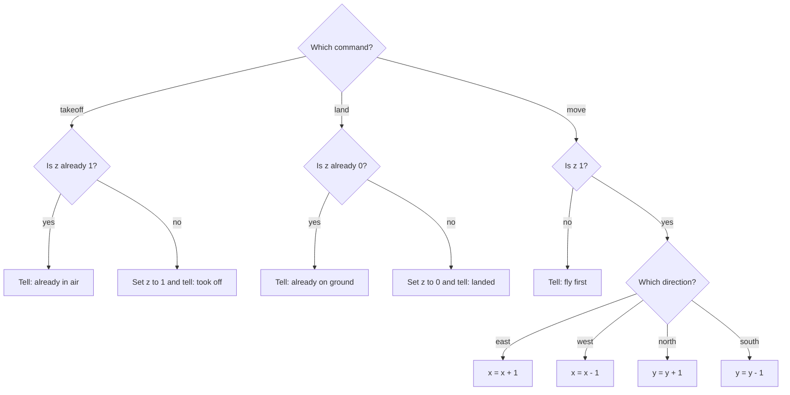

```mermaid
flowchart TD
  cmd{Which command?}
  cmd -->|takeoff| air{Is z already 1?}
  air -->|yes| already_air[Tell: already in air]
  air -->|no| takeoff[Set z to 1 and tell: took off]
  cmd -->|land| ground{Is z already 0?}
  ground -->|yes| already_land[Tell: already on ground]
  ground -->|no| land[Set z to 0 and tell: landed]
  cmd -->|move| flying{Is z 1?}
  flying -->|no| on_ground[Tell: fly first]
  flying -->|yes| dir{Which direction?}
  dir -->|east| go_east[x = x + 1]
  dir -->|west| go_west[x = x - 1]
  dir -->|north| go_north[y = y + 1]
  dir -->|south| go_south[y = y - 1]
```
